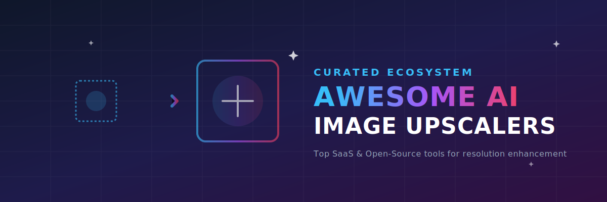

# 🚀 Awesome-Image-Upscalers

  

  
  
  
  

## 🌟 Top Image Upscaler Ecosystem & AI Resolution Enhancers

**Curated List of SaaS Products & Open-Source GitHub Projects**  
*Focused on AI-Powered Image Enlargement, Enhancement & Resolution Upscaling*  
**Last updated: March 2026**

This repository tracks notable **SaaS platforms** and **open-source projects** for **AI Image Upscalers**. These tools use deep learning models to intelligently enlarge images while preserving or enhancing details, sharpness, textures, and reducing artifacts — essential for photography, digital art, game assets, and restoration work.

**Examples** include Topaz Gigapixel AI (Desktop-Based), Aiarty Image Enhancer (Desktop-Based), Magnific AI (Web-Based), LetsEnhance (Web-Based), Adobe Firefly (Web-Based), Upscayl (Open-Source), and ILoveIMG (Open-Source/free) (the category leaders). Tools listed here emphasize **detail preservation**, artifact reduction, speed, and support for batch processing.

**Open-source emphasis**: This section is heavily expanded with every major active project for self-hosting, local execution, model fine-tuning, and complete customization — ideal for creators, developers, and privacy-conscious users who want unlimited usage without subscriptions.

Contributions welcome! Open a PR to add/update entries. Keep descriptions factual and link to official sites.

## 📋 Table of Contents
- [SaaS / Commercial Tools](#saas--commercial-tools)
- [Open-Source GitHub Projects](#open-source-github-projects)
- [How to Contribute](#how-to-contribute)
- [Disclaimer](#disclaimer)

## 🛠️ SaaS / Commercial Tools

| Product | Description | Pricing | Free Tier Limit | Company Size (Est. Revenue / Valuation) |
| :--- | :--- | :--- | :--- | :--- |
| **[Adobe Firefly](https://firefly.adobe.com/)** | Integrated AI image enhancement and upscaling within Adobe’s creative ecosystem. | Paid plans start at $4.99/month | 25 generative credits/month | ~$23.77B Revenue / ~$78B Valuation |
| **[Magnific AI](https://magnific.ai/)** | Creative AI upscaler focused on artistic and highly detailed enlargement with creative controls. | Paid plans start at $39.00/month | None | ~$230M ARR / €250M Valuation (Freepik) |
| **[Topaz Gigapixel AI](https://topazlabs.com/gigapixel-ai)** | Industry-leading desktop AI upscaler known for exceptional detail recovery and natural results. | Paid plans start at $99.99/year or $99/license | None (Free trial only with watermarked exports) | ~$50M Revenue |
| **[Aiarty Image Enhancer](https://aiarty.com/)** | Powerful desktop tool with multiple AI models for upscaling, denoising, and face enhancement. | $85.00 one-time license | Free version available (includes watermarks and no batch export support) | ~$5M - $10M Revenue (Est. Digiarty) |
| **[LetsEnhance](https://letsenhance.io/)** | Web-based AI upscaler with strong batch processing and smart enhancement features. | Paid plans start at $9.00/month | 10 free credits upon signup (watermarked exports) | ~$5M Revenue / ~$13.1M Valuation |
| **[VanceAI](https://vanceai.com/)** | Cloud-based AI photo enhancement and editing tools. | Paid plans start at $4.95/month | 3 free credits/month (watermarked exports) | ~$1.3M Revenue / ~$4M Valuation |
| **[Bigjpg](https://bigjpg.com/)** | AI image upscaler using Deep Convolutional Neural Networks, optimized for anime images and photos. | Paid plans start at $6.00/one-time or subscription | 20 images/month (max 5MB file size, up to 4x upscaling) | <$1M Revenue |

## 💻 Open-Source GitHub Projects

### ⚙️ Dedicated Image Upscaler Tools

- **[Upscayl](https://github.com/upscayl/upscayl)**   
  Popular free and open-source AI image upscaler with a beautiful GUI. Supports multiple models (Real-ESRGAN, etc.) and runs locally on consumer GPUs.

- **[GFPGAN](https://github.com/TencentARC/GFPGAN)**   
  Classic open-source face restoration and enhancement model often used alongside upscalers.

- **[Real-ESRGAN](https://github.com/xinntao/Real-ESRGAN)**   
  State-of-the-art open-source image super-resolution model with excellent real-world performance and extensions for anime/artwork.

- **[Waifu2x](https://github.com/nagadomi/waifu2x)**  (and modern forks)  
  Classic open-source upscaler optimized for anime-style art but effective on general images.

- **[CodeFormer](https://github.com/sczhou/CodeFormer)**   
  Blind face restoration and upscaling model with strong performance on low-quality or old photos.

- **[SRGAN / ESRGAN](https://github.com/xinntao/ESRGAN)**   
  Foundational generative adversarial networks for photo-realistic image super-resolution.

- **[chaiNNer](https://github.com/chaiNNer-org/chaiNNer)**   
  Node-based GUI for running and chaining AI upscaling, enhancement, and restoration models.

- **[SwinIR](https://github.com/JingyunLiang/SwinIR)**   
  Transformer-based image restoration and super-resolution model with outstanding detail reconstruction.

- **[Ultimate-Upscale](https://github.com/Coyote-A/ultimate-upscale-for-automatic1111)**   
  Popular extension for Automatic1111 Stable Diffusion WebUI with advanced upscaling workflows.

- **[ILoveIMG Open-Source Alternatives](https://github.com/search?q=image+upscaler+open+source)**  
  Multiple community tools and web UIs for batch image processing and upscaling.

### 🔌 Additional Strong Open-Source Options

- **[Topaz Gigapixel Open Alternatives** — Various Real-ESRGAN based forks with improved models.
- **[Stable Diffusion Upscalers** — Community models optimized for creative upscaling.
- **[VapourSynth** scripts with AI plugins for professional video/frame upscaling.
- **[Krita** with AI upscaling plugins for digital artists.
- Many **Ollama + Vision** and local LLM-assisted upscaling pipelines.

**Recommended Toolchains**: **Upscayl** + **chaiNNer** + **Real-ESRGAN** models for a complete local, free, and powerful upscaling workflow.

## 🤝 How to Contribute

1. Fork the repo.
2. Add/edit entries in `README.md` (follow existing format).
3. Include: name, link, 1–2 sentence description, and whether it's SaaS or open-source.
4. Submit PR with a short explanation.

Star the repo if you find it useful!

## ⚠️ Disclaimer

- This is a **community-curated** list — not exhaustive and not an endorsement.
- AI upscaling results can vary significantly depending on the source image quality and model choice.
- Always respect copyright and licensing when upscaling and redistributing images.

## 📈 Star History

<a href="https://www.star-history.com/?repos=ishandutta2007%2FAwesome-Image-Upscalers&type=date&legend=bottom-right">
<picture>
<source media="(prefers-color-scheme: dark)" srcset="https://api.star-history.com/chart?repos=ishandutta2007/Awesome-Image-Upscalers&type=date&theme=dark&legend=bottom-right" />
<source media="(prefers-color-scheme: light)" srcset="https://api.star-history.com/chart?repos=ishandutta2007/Awesome-Image-Upscalers&type=date&legend=bottom-right" />

</picture>
</a>

---

**Made for photographers, digital artists, game developers, and content creators.**  
Let's make high-quality image upscaling more accessible, private, and powerful.